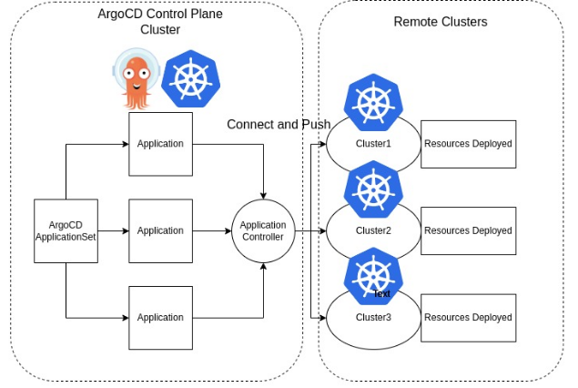
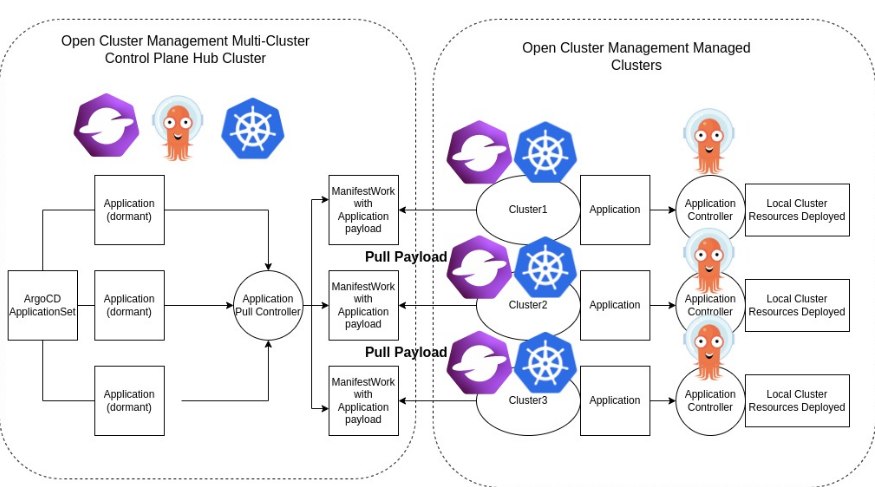

# ArgoCD Application Pull Controller
[ArgoCD](https://argo-cd.readthedocs.io/en/stable/) Application controller that uses the hub-spoke pattern or pull model mechanism for decentralized resource delivery to the remote clusters.
By using the [Open Cluster Management (OCM)](https://open-cluster-management.io/) APIs and components, 
the ArgoCD Applications will be pull from the multi-cluster control plane hub cluster down to 
the registered OCM managed clusters.

**Note:** The primary goal of this project is to migrate existing native OCM application delivery `AppSubscription` users to ArgoCD.
The pull model described in this project might not be suited in every situation,
it is designed with the existing OCM AppSubscription users in mind to match their existing use cases.

## Description
The current ArgoCD resource delivery is primarily pushing resources from a centralized cluster to the remote/managed clusters.



By using this controller, users can have a pull model resource delivery mechanism.



The pull model may offers some advantages over the existing push model:
- Scalability: hub-spoke pattern may offers better scalability.
- Security: cluster credentials doesn't have to be stored in a centralized environment may enhance security.
- It may reduce the impact of a single point of centralized failure.

This ArgoCD pull model controller on the Hub cluster will create [ManifestWork](https://open-cluster-management.io/concepts/manifestwork/) objects wrapping Application objects as payload.
The OCM agent on the Managed cluster will see the ManifestWork on the Hub cluster and pull the Application down.

## Dependencies
- The Open Cluster Management (OCM) multi-cluster environment needs to be setup. See [OCM website](https://open-cluster-management.io/) on how to setup the environment.
- In this pull model, OCM will provide the cluster inventory and ability to deliver workload to the remote/managed clusters.
- Hub cluster and remote/managed clusters need to have ArgoCD Application installed. See [ArgoCD website](https://argo-cd.readthedocs.io/en/stable/getting_started/) for more details.

## Getting Started
1. Setup an OCM Hub cluster and registered an OCM Managed cluster. See [Open Cluster Management Quick Start](https://open-cluster-management.io/getting-started/quick-start/) for more details.

2. Install ArgoCD on both clusters. See [ArgoCD website](https://argo-cd.readthedocs.io/en/stable/getting_started/) for more details.

3. On the Hub cluster, scale down the Application controller:
```
kubectl -n argocd scale statefulset/argocd-application-controller --replicas 0
```
**Note** This step is not necssary if the ArgoCD instance you are using contains the feature: 
https://argo-cd.readthedocs.io/en/latest/user-guide/skip_reconcile/

4. Clone this project and connect to the Hub cluster and start the Pull controller:
```
git clone ...
cd argocd-pull-integration
export KUBECONFIG=/path/to/<hub-kubeconfig>
make deploy
```

5. If your controller starts successfully, you should see:
```
$ kubectl -n argocd get deploy | grep pull
argocd-pull-integration-controller-manager   1/1     1            1           106s
```

6. On the Hub cluster, create an ArgoCD cluster secret that represent the managed cluster. This step can be automated with [OCM auto import controller](https://github.com/open-cluster-management-io/multicloud-integrations/).
**Note** replace the `cluster-name` with the registered managed cluster name.
```
cat <<EOF | kubectl apply -f -
apiVersion: v1
kind: Secret
metadata:
  name: <cluster-name>-secret # cluster1-secret
  namespace: argocd
  labels:
    argocd.argoproj.io/secret-type: cluster
type: Opaque
stringData:
  name: <cluster-name> # cluster1
  server: https://<cluster-name>-control-plane:6443 # https://cluster1-control-plane:6443
EOF
```

7. On the Hub cluster, apply the manifests in `example/hub`:
```
kubectl apply -f example/hub
```

8. On the Managed cluster, apply the manifests in `example/managed`:
```
kubectl apply -f example/managed
```

9. On the Hub cluster, apply the `guestbook-app-set` manifest:
```
kubectl apply -f example/guestbook-app-set.yaml
```
**Note** The Application template inside the ApplicationSet must contain the following content:
```
      labels:
        apps.open-cluster-management.io/pull-to-ocm-managed-cluster: 'true'
      annotations:
        argocd.argoproj.io/skip-reconcile: 'true'
        apps.open-cluster-management.io/ocm-managed-cluster: '{{name}}'
```
The label allows the pull model controller to select the Application for processing.

The `skip-reconcile` annotation is to prevent the Application from reconciling on the Hub cluster.

The `ocm-managed-cluster` annotation is for the ApplicationSet to generate multiple Application based on each cluster generator targets.

10. When this guestbook ApplicationSet reconciles, it will generate an Application for the registered ManagedCluster. For example:
```
$ kubectl -n argocd get appset
NAME            AGE
guestbook-app   84s
$ kubectl -n argocd get app
NAME                     SYNC STATUS   HEALTH STATUS
cluster1-guestbook-app     
```

11. On the Hub cluster, the pull controller will wrap the Application with a ManifestWork. For example:
```
$ kubectl -n cluster1 get manifestwork
NAME                          AGE
cluster1-guestbook-app-d0e5   2m41s
```

12. On the Managed cluster, you should see the Application is pulled down successfully. For example:
```
$ kubectl -n argocd get app
NAME                     SYNC STATUS   HEALTH STATUS
cluster1-guestbook-app   Synced        Healthy
$ kubectl -n guestbook get deploy
NAME           READY   UP-TO-DATE   AVAILABLE   AGE
guestbook-ui   1/1     1            1           7m36s
```

13. On the Hub cluster, the status controller will sync the dormant Application with the ManifestWork status feedback. For example:
```
$ kubectl -n argocd get app
NAME                     SYNC STATUS   HEALTH STATUS
cluster1-guestbook-app   Synced        Healthy
```

## Community, discussion, contribution, and support

Check the [CONTRIBUTING Doc](CONTRIBUTING.md) for how to contribute to the repo.

### Communication channels

Slack channel: [#open-cluster-mgmt](https://kubernetes.slack.com/channels/open-cluster-mgmt)

## License

This code is released under the Apache 2.0 license. See the file [LICENSE](LICENSE) for more information.
