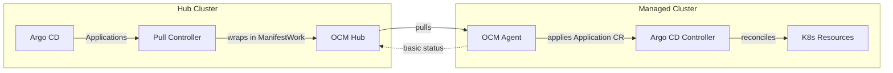
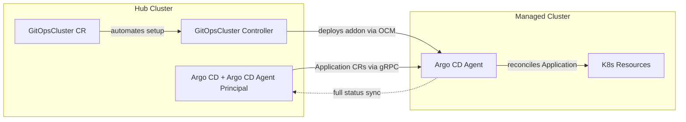

# Argo CD Pull Integration with Open Cluster Management

A Kubernetes operator that enables pull-based Argo CD application delivery for multi-cluster environments using [Open Cluster Management (OCM)](https://open-cluster-management.io/). 

This repository provides the **advanced pull model** powered by [argocd-agent](https://argocd-agent.readthedocs.io/), delivering superior Argo CD UI integration with full application status synchronization, detailed resource health, and live state comparison. While slightly more complex to set up than the basic model, the `GitOpsCluster` custom resource automates the entire deployment process with better integration with the Argo CD core project.

The **basic pull model** is also supported for simpler use cases.

## Overview

Traditional Argo CD deployments use a "push" model where applications are pushed from a centralized Argo CD instance to remote clusters. This project enables a "pull" model where remote clusters pull their applications from a central hub, providing better scalability, security, and resilience.

## Two Deployment Models

### Basic Pull Model

The basic pull model is a simpler approach that wraps Argo CD Application CRs in OCM ManifestWork objects and distributes them to managed clusters. It uses Argo CD's [skip-reconcile feature](https://argo-cd.readthedocs.io/en/latest/user-guide/skip_reconcile/) to prevent the hub from reconciling applications, allowing local Argo CD instances on managed clusters to handle reconciliation.



**How it works:**
1. Argo CD Applications on the hub are marked with `apps.open-cluster-management.io/pull-to-ocm-managed-cluster: "true"` label
2. Applications include the [`argocd.argoproj.io/skip-reconcile: "true"`](https://argo-cd.readthedocs.io/en/latest/user-guide/skip_reconcile/) annotation to prevent hub-side reconciliation
3. A controller wraps these Applications in ManifestWork objects
4. OCM agents pull the ManifestWork and apply the Application CRs to managed clusters
5. Local Argo CD instances reconcile the applications
6. Basic status information is reflected back through ManifestWork

**For complete documentation and deployment instructions, see:**
[https://github.com/open-cluster-management-io/ocm/tree/main/solutions/deploy-argocd-apps-pull](https://github.com/open-cluster-management-io/ocm/tree/main/solutions/deploy-argocd-apps-pull)

### Advanced Pull Model (argocd-agent)

The advanced pull model powered by [argocd-agent](https://argocd-agent.readthedocs.io/) provides multi-cluster GitOps with superior Argo CD integration. This model delivers the full Argo CD experience across all your clusters with complete status synchronization visible in the Argo CD UI.



**Key Benefits:**
- **Superior Argo CD UI Integration**: Full application details, resource tree, live state, and sync status displayed perfectly in the Argo CD UI
- **Complete Status Synchronization**: Detailed resource health, sync state, and errors reflected back to the hub in real-time
- **Better Argo CD Core Integration**: Built on the official argocd-agent project with direct integration to Argo CD core
- **Automated Setup via GitOpsCluster**: The `GitOpsCluster` CR automates the entire deployment process - while more advanced than the basic model, it handles all complexity

**How it works:**
1. Create a `GitOpsCluster` CR that references an OCM Placement to select target clusters
2. The controller automatically deploys argocd-agent, configures secure gRPC communication, manages certificates, and sets up cluster registration
3. argocd-agent connects to hub Argo CD and synchronizes applications with **full status feedback**

For detailed argocd-agent architecture and operational modes, see [argocd-agent Documentation](https://argocd-agent.readthedocs.io/).

## Comparison: Basic vs Advanced

| Feature | Basic Pull Model | Advanced Pull Model (argocd-agent) |
|---------|-----------------|-----------------------------------|
| **Ease of Setup** | ✅ Easier - minimal configuration | ⚠️ More complex - automated via GitOpsCluster |
| **Argo CD UI Display** | ⚠️ Limited UI information | ✅ Full Argo CD UI with resource tree & live state |
| **Application Status** | ⚠️ Basic status via ManifestWork | ✅ Full detailed status via argocd-agent |
| **Resource Health** | ⚠️ Limited health information | ✅ Complete resource health details |
| **Sync Status** | ⚠️ Basic sync information | ✅ Detailed sync status and errors |
| **Live State** | ⚠️ Not available | ✅ Live state comparison |
| **Argo CD Core Integration** | ⚠️ External controller | ✅ Official argocd-agent project |
| **Setup Automation** | Manual RBAC and Argo CD setup | ✅ Automated via GitOpsCluster CR |
| **Certificate Management** | Manual | ✅ Automated |
| **Cluster Registration** | Manual cluster secrets | ✅ Automated via addon |
| **Skip Reconciliation** | ✅ Uses `argocd.argoproj.io/skip-reconcile` | ✅ Agent handles reconciliation |
| **Best For** | Simple deployments, quick starts | Full observability, automated management |

### When to Use Each Model

**Use the Basic Pull Model if:**
- You want quick setup with minimal components
- Basic status feedback is sufficient
- You already have Argo CD installed on managed clusters
- You prefer manual control over Argo CD configuration
- You're just getting started with pull-based deployments

**Use the Advanced Pull Model (this repo) if:**
- You need complete application status visibility on the hub
- You want automated setup and lifecycle management
- You need detailed resource health and sync information
- You need full Argo CD UI integration
- You want simplified management of many clusters via `GitOpsCluster` CR

## Prerequisites

- **Kubernetes**: v1.11.3+ clusters (hub and managed)
- **Open Cluster Management (OCM)**: Hub cluster with registered managed clusters
  - See [OCM Quick Start](https://open-cluster-management.io/getting-started/quick-start/)
- **Argo CD**: Installed on hub cluster
  - argocd-agent will be deployed automatically to managed clusters
- **Go**: v1.24.0+ (for building from source)
- **Docker**: 17.03+ (for building container images)
- **kubectl**: v1.11.3+

## Getting Started with Advanced Pull Model (argocd-agent)

### Installation

1. **Setup OCM**: Install Open Cluster Management on your hub cluster and register your managed clusters. See [OCM Quick Start](https://open-cluster-management.io/getting-started/quick-start/)

2. **Setup Load Balancer**: Ensure your hub cluster has a load balancer configured for exposing Argo CD server to managed clusters for argocd-agent connectivity

3. **Install Helm Chart**:

```bash
helm install argocd-agent-addon ./charts/argocd-agent-addon \
  --namespace open-cluster-management-agent-addon \
  --create-namespace
```

This installs the GitOpsCluster controller and creates a GitOpsCluster resource that automatically deploys argocd-agent to your managed clusters.

### Understanding GitOpsCluster

The `GitOpsCluster` custom resource is the control plane for managing argocd-agent deployments. It automates the entire setup process:

- **Cluster Selection**: References an OCM Placement to select which managed clusters receive argocd-agent
- **Automated Deployment**: Deploys argocd-agent to all selected clusters via OCM addon framework
- **Certificate Management**: Automatically generates and distributes TLS certificates for secure gRPC communication
- **Server Discovery**: Auto-discovers Argo CD server address and port
- **Status Monitoring**: Provides conditions to track deployment status

**Example GitOpsCluster configuration:**

```yaml
apiVersion: apps.open-cluster-management.io/v1alpha1
kind: GitOpsCluster
metadata:
  name: my-gitops-cluster
  namespace: open-cluster-management
spec:
  placementRef:
    kind: Placement
    name: argocd-placement  # OCM Placement to select clusters
  argoCDAgentAddon:
    mode: managed  # or "autonomous" - see argocd-agent docs
```

For detailed information about argocd-agent modes and configuration options, see the [argocd-agent Documentation](https://argocd-agent.readthedocs.io/).

## Development

For building from source and running tests:

```bash
make build     # Build binary
make test      # Run tests
make install   # Install CRDs
```

See [CONTRIBUTING.md](CONTRIBUTING.md) for development guidelines.

## Contributing

We welcome contributions! Please see our [Contributing Guide](CONTRIBUTING.md) for details.

This project adheres to the Open Cluster Management [Code of Conduct](https://github.com/open-cluster-management-io/community/blob/main/CODE_OF_CONDUCT.md).

### Community

- **Slack**: [#open-cluster-mgmt](https://kubernetes.slack.com/channels/open-cluster-mgmt) on Kubernetes Slack
- **GitHub Issues**: Report bugs or request features
- **Community**: [Open Cluster Management](https://open-cluster-management.io/community/)

## License

argocd-pull-integration is licensed under the [Apache License 2.0](LICENSE).
